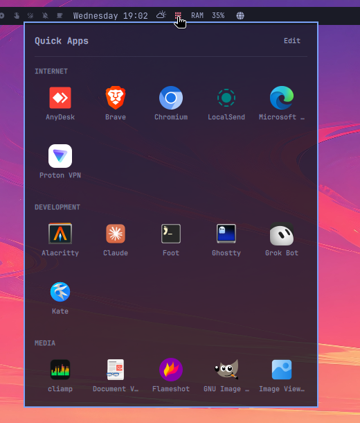

# Quick Apps

A discreet launcher in the Omarchy bar: the applications you actually use,
grouped into your own categories, one hover away — no click, no window, no
searching through a full application list.



## What it does

One small icon in the bar. Rest the pointer on it and a translucent panel drops
down with your applications as icon tiles, under headings you name yourself
("Internet", "Work", "Games" — whatever you keep going back to). Each category
carries its own colour, laid on thin behind its tiles. Click a tile to launch,
move the pointer away and the panel is gone.

On top sits **what you actually use**: the applications you open most, ranked,
each with the number of times you have opened it, next to a chart of the same
numbers. Every tile in the grid below carries that count too, as a small badge
in its category's colour — and each category sorts itself so the things you
reach for rise to the front of their group. The counting is not limited to this
panel: opening something from a keybinding, the Omarchy menu or a terminal moves
its counter just the same.

The same panel opens from a keybinding, and that open is keyboard-driven: arrow
keys move between tiles, typing filters them, Enter launches, Escape closes.

The grid is edited in place — **Edit** turns on add, remove, rename, recolour
and reorder right in the panel, so you never have to hand-write a config file to
change what is in it (though you can; it is plain JSON).

## Requirements

| | |
|---|---|
| **Omarchy** | 4.x (the Quickshell `omarchy-shell`) |
| **Applications** | Anything with a `.desktop` entry — the panel reads the same application index as the Omarchy menu |

No daemon, no extra packages, nothing to enable.

## Install

```bash
omarchy plugin add https://github.com/samara-hub-ro/samara-quick-apps.git --enable --yes
```

Plugins run as unsandboxed code inside `omarchy-shell`. Drop `--enable --yes` to
review the source before enabling it:

```bash
omarchy plugin add https://github.com/samara-hub-ro/samara-quick-apps.git
# review ~/.config/omarchy/plugins/samara-hub-ro.quick-apps/
omarchy plugin enable samara-hub-ro.quick-apps --section center
```

It lands in the bar's centre section. Move it with:

```bash
omarchy bar move samara-hub-ro.quick-apps --section right
```

Updating and removal are the usual commands:

```bash
omarchy plugin update samara-hub-ro.quick-apps
omarchy plugin remove samara-hub-ro.quick-apps
```

> **Bar widgets need a full shell restart to re-instantiate.**
> `omarchy-shell shell rescanPlugins` reloads plugin *code*, but live bar
> widgets keep their existing instances. After installing or hacking on this
> plugin, run `omarchy restart shell` if the bar looks unchanged.

## Using it

**Bar icon**

| Action | Result |
|---|---|
| Hover | Open the panel (after `hoverOpenDelay`) |
| Left click | Open / close it |
| Right click | Open it straight into edit mode |

Moving the pointer off both the icon and the panel closes it again after
`hoverCloseDelay`, which is there so crossing the gap between the two does not
snap it shut. A panel you are editing never closes on its own.

**Panel**

- **Click a tile** to launch it. The panel closes as it launches.
- **Most used** sits above the categories: your busiest applications, ranked,
  with their counts and a chart of the same numbers. The rows launch on click
  like any tile. On a launcher nothing has been opened from yet it says so and
  shows the chart idle. It is hidden while you are editing or filtering.
- **Tiles sort themselves** inside each category, most-launched first. Turn it
  off with `sortByUsage` to go back to the order you arranged.
- **Edit** turns the grid into an editor: drag a category by the handle on its
  left to move it, click its swatch to recolour it, rename it in place, `＋` add
  an application to it, `↑ ↓` nudge it one step, `✕` delete it, and on each tile
  `✕` removes it while `‹ ›` reorder it. **＋ Category** adds a new group.
- Adding an application opens a searchable list of everything installed; the
  ones already in that category are marked and inert, so you can add several in
  a row without losing your place. **Esc** goes back.

**Keyboard**, once the panel is open from the keybinding (a hover or click open leaves the keyboard where it was; pressing **Edit** claims it too):

| Key | Result |
|---|---|
| `←` `→` `↑` `↓` | Move between tiles |
| `Enter` | Launch the selected application |
| Any letter | Filter the grid; `Backspace` deletes, `Esc` clears |
| `Tab` | Move to the neighbouring bar panel |
| `Esc` | Close |

A pointer-opened panel deliberately does **not** take the keyboard, so passing
the pointer over the bar never swallows a keystroke from whatever you were
typing in.

## Counting what you open

Every application in the launcher carries a count of how many times you have
opened it, shown as a small badge on its tile and spelled out in the ranking on
top. Opening it from the panel counts; so does opening it from a keybinding, the
Omarchy menu, a terminal or any other launcher.

The counter is worth being precise about, because it is exact in some places and
an inference in others:

- It counts **from the moment the application was added to a category**, not
  from when you installed it and not from when you installed this plugin. `18`
  means "eighteen times since you put this here".
- Taking an application out of a category **forgets its count**. Put it back and
  it starts from zero, because by the rule above that is what its count now
  means.
- A launch **from the panel** — a tile clicked, a ranking row clicked, `Enter`
  on the keyboard cursor — is counted directly and exactly once. This is the
  part that is certain.
- A launch **from anywhere else** is inferred from a window appearing, because
  nothing on the system announces that an application was started. That
  inference is good but not perfect:
  - It counts **windows**. An application that reuses a window it already has —
    a browser opening a link in a tab, a single-instance editor opening a file
    — has not opened a window and will not move. Opening a *second* window of
    something already running does count.
  - It has to **recognise the window**. A window whose class matches no entry in
    your launcher counts for nobody, and one that matches *two* also counts for
    nobody: crediting the wrong application is worse than not counting, since
    you would have no way to notice and no way to correct it.
  - Two windows of the same application inside 1.5 seconds count **once**, which
    is nearly always a splash screen rather than you opening two.
  - Windows already open when the shell starts are **not** launches.
- Set `countExternalLaunches` to `false` to go back to counting only what you
  launch from the panel.
- **Counters start at zero** on a fresh install and on an upgrade — there has
  never been anything to carry over.

Counts live in `~/.config/omarchy/quick-apps-usage.json`, beside the categories
rather than inside them: they change on every launch, and rewriting the file you
hand-edit once per launch is a good way to lose a hand edit.

```json
{
  "version": 1,
  "apps": {
    "brave-browser": { "count": 18, "since": "2026-09-03T09:22:31.778Z", "last": "2026-09-03T11:04:02.331Z" }
  }
}
```

To wipe the slate without touching your categories:

```bash
omarchy-shell samara-hub-ro.quick-apps resetCounts
```

Turn the badges off with `showLaunchCounts`, the ranking with `showMostUsed`,
and the chart alone with `showUsageChart`. The file is still kept either way.

An application that has never been opened from here shows `0` rather than no
badge at all — a counter that only appears once you have used it is a counter
nobody finds on the day they install the plugin.

### Sorting by what you use

Each category orders its tiles most-launched first. It is a view over the
counts, not a rewrite: the order in `quick-apps.json` stays exactly as you
arranged it, applications you have never opened keep that order among
themselves, and turning `sortByUsage` off puts everything straight back.

While the sort is on, the per-tile `‹ ›` buttons are hidden. The order is
derived at that point, so a move button could only lie about what it does —
turn the sort off if you want to arrange tiles by hand.

### The chart

The ranking sits next to a small instrument: one glowing arc per application,
each on its own orbit, its length that application's share of the busiest one's
count — outermost ring is the one you open most — inside a frame carrying the
total.

It is deliberately not a bar chart, a pie or a donut. Those spend their ink on
comparing every slice against every other, which is not the question here: the
rows beside it already carry the exact numbers, so what is left for the chart is
the shape of the habit at a glance.

## The bar mark

The icon in the bar is a downward-pointing triangle with an S cut out of it —
the triangle for the panel it drops, the S for samara. It is painted rather
than shipped as an image, so it takes the bar's own colour and its active tint,
and stays crisp at whatever height your bar happens to be.

To use a glyph instead, put one in `icon`; the old default was `󰀻`. An
empty `icon` means the drawn mark.

## Colours

Every category washes its own background in its own colour. The default is 30%
opacity — **70% transparent** — which is enough to group the tiles under it and
far too faint to fight the icons. That colour also tints the category's heading,
its tile highlights, its launch badges and its arc in the chart, so a tile reads
as belonging to its group from any of them.

Categories that have never been given a colour follow a built-in palette by
position, so a fresh install is colour-coded without anyone configuring
anything. To choose one, hit **Edit** and click the swatch beside a category's
name: the palette unfolds under the heading, and the hollow `A` puts that
category back on automatic.

Chosen colours are stored per category in `quick-apps.json`, as a hex string:

```json
{ "id": "work", "name": "Work", "color": "#a78bfa", "apps": ["obsidian", "slack"] }
```

Anything that is not a `#rgb` or `#rrggbb` string — including no key at all — is
read as "follow the palette". `categoryTint` sets how strongly the wash lands;
`0` turns it off and leaves the rest of the colour coding in place.

## Reordering categories

Hit **Edit** and every category grows a handle on its left. Press it and drag:
an insertion line shows where the category will land, and the move is committed
when you let go — nothing shifts under the pointer mid-drag. The `↑ ↓` buttons
beside each name are still there for a one-step nudge, and the order in
`quick-apps.json` is the order in the panel, so you can also just rearrange the
file.

## A keybinding

Nothing is bound by default — pick a free key in `~/.config/hypr/bindings.lua`:

```lua
o.bind("SUPER + A", "Quick Apps", "omarchy-shell samara-hub-ro.quick-apps toggle")
```

`toggle`, `open`, `close`, `show`, `hide`, `edit` and `resetCounts` are all
accepted — `edit` opens straight into the editor, which is worth a second
binding if you rearrange often:

```bash
omarchy-shell samara-hub-ro.quick-apps toggle
omarchy-shell samara-hub-ro.quick-apps edit
```

On a multi-monitor setup the widget exists once per bar, and IPC reaches the
first one that registered — the same way Omarchy's own panels behave.

## Settings

Configured per bar entry in `~/.config/omarchy/shell.json`, or through Omarchy's
plugin settings UI, which builds a form from the manifest schema.

| Key | Type | Default | What it does |
|---|---|---|---|
| `openOnHover` | boolean | `true` | Open the panel when the pointer rests on the icon |
| `hoverOpenDelay` | integer (ms) | `140` | How long the pointer has to stay before it opens |
| `hoverCloseDelay` | integer (ms) | `280` | Grace period after the pointer leaves both icon and panel |
| `backgroundOpacity` | integer (%) | `82` | Opacity of the panel background |
| `iconSize` | integer (px) | `30` | Size of each application icon |
| `columns` | integer | `5` | Tiles per row — this is what sets the panel's width |
| `maxHeight` | integer (px) | `520` | Height at which the scrolling grid starts scrolling instead of growing. The most-used strip sits above it and is not charged against this |
| `showLabels` | boolean | `true` | Print application names under the icons |
| `showMostUsed` | boolean | `true` | Rank your busiest applications above the categories |
| `mostUsedCount` | integer | `5` | How many the ranking lists, and how many orbits the chart draws (1–6) |
| `showUsageChart` | boolean | `true` | Draw the chart beside the ranking |
| `showLaunchCounts` | boolean | `true` | Print the launch-count badge on each tile |
| `countExternalLaunches` | boolean | `true` | Also count applications opened from a keybinding, the Omarchy menu or a terminal |
| `sortByUsage` | boolean | `true` | Order the tiles in each category most-launched first |
| `countIcon` | string | `` | Glyph shown next to a launch count |
| `categoryTint` | integer (%) | `30` | How strongly a category's colour washes its background; `30` is 70% transparent, `0` is off |
| `seedOnFirstRun` | boolean | `true` | Fill the categories from installed applications the first time |
| `icon` | string | *(empty)* | Glyph shown in the bar; empty means the drawn mark |
| `configPath` | string | *(empty)* | Name of the categories file **inside `~/.config/omarchy/`** — `work.json`, say. Empty means `quick-apps.json`. Anything that is not a plain `.json` name in that directory is ignored and the default is used |

Both files stay inside `~/.config/omarchy/`. `configPath` names one of them; it
does not point anywhere, so there is no path for a stray value to escape down
and no way for the counts to be written over the categories.

```jsonc
{
  "id": "samara-hub-ro.quick-apps",
  "columns": 6,
  "iconSize": 40,
  "backgroundOpacity": 65,
  "showLabels": false,
  "mostUsedCount": 3,
  "categoryTint": 22
}
```

## The categories file

Your applications are **not** kept in `shell.json` — they are content rather
than configuration, and the panel rewrites them every time you add or remove a
tile. They live in `~/.config/omarchy/quick-apps.json`:

```json
{
  "version": 1,
  "categories": [
    { "id": "internet", "name": "Internet", "color": "",        "apps": ["brave-browser", "chromium"] },
    { "id": "work",     "name": "Work",     "color": "#a78bfa", "apps": ["obsidian", "slack"] }
  ]
}
```

`apps` holds desktop-entry ids — the `.desktop` filename without its extension.
`color` is optional; an empty or missing one follows the palette by position.
The order of the list is the order you arranged, which is what the panel shows
with `sortByUsage` off — with it on, the panel sorts that list by launch count
for display without touching the file.
The file is watched, so editing it by hand updates the panel immediately, and
anything malformed in it is ignored rather than thrown away. An application
whose `.desktop` file has since disappeared keeps its tile, greyed out, so you
can see what to remove instead of wondering where it went.

The first time the panel opens with nothing in it, it builds a starting set from
the applications you have installed, bucketed by their own XDG categories
(Internet, Development, Media, Office, System). It is a starting point, not a
policy — rename it, regroup it, delete what you do not want. Turn
`seedOnFirstRun` off to start from an empty panel instead.

### What the panel will read

Both files are treated as input, not as something the panel wrote and can
therefore trust — you edit one of them by hand, and a file on disk is whatever
happens to be on disk. So there are ceilings, checked before anything is parsed,
cloned, sorted or drawn:

| | Limit |
|---|---|
| Either file, on disk | 256 KiB — a bigger one is ignored, and left where it is |
| Categories | 64 |
| Applications in a category | 256 |
| Applications in total | 1024 |
| Category name | 96 characters |
| Desktop-entry id | 255 characters |
| Any text taken from a `.desktop` file | 160 characters |
| Entries in the counts file | 4096 |

They are far above any launcher anyone builds by hand and far below anything
that costs the shell noticeable memory or a dropped frame. What goes over a
ceiling is dropped, not truncated into something else: an over-long id would
otherwise silently name a different application. The panel enforces the same
ceilings on what *it* writes, so a file it saved always reads back identically.

## Transparency

`backgroundOpacity` sets the panel's alpha over whatever is behind it; the
colour itself comes from your theme's `popups.background`, so the panel follows
a theme switch like every other Omarchy surface.

For a frosted panel rather than a plain translucent one, blur its layer in
Hyprland — the surface is namespaced `samara-quick-apps`:

```lua
hl.config({ decoration = { blur = { enabled = true } } })
hl.layer_rule({ match = { namespace = "samara-quick-apps" }, blur = true })
```

Omarchy ships with compositor blur off, so the first line is the price of the
second — it turns blur on for the whole desktop.

## How it works

**Hover without breaking hover.** A popup that opens on hover has an awkward
problem: Omarchy's keyboard-capable panel base claims the entire screen as its
input region, so the moment it opens, the bar stops seeing the pointer — the
icon "un-hovers" and the panel would close itself. This plugin ships its own
panel surface, adapted from `Ui/KeyboardPanel.qml`, whose input region is
narrowed to the card. The bar keeps its own hover, and the widget decides
"open" from the union of the icon's hover and the card's, with a delay on each
edge.

**Except when the keyboard is involved.** Hyprland hands keyboard focus back to
whatever is under the pointer the moment a layer surface steps down from its
focus grab, so a panel that wants to keep the keyboard has to be under the
pointer wherever the pointer is. When the panel is opened from the keybinding
(or a click), it takes the whole screen as its input region — which is also what
gives outside clicks something to land on for dismissal. Hover-opened, it stays
narrow and takes no keyboard focus at all.

**Counting launches nobody announces.** There is no signal anywhere for "an
application was started" — the shell's own `AppLibrary.launch` emits none, and
neither does anything else on the bus. What a Wayland compositor *does* announce
is a new window, so that is what the plugin watches, mapping the window's class
back to one of the entries in your launcher.

That mapping is the whole difficulty, and the rule that shapes it is: **when a
window looks like two different applications, credit neither.** A count quietly
attributed to the wrong application is worse than a count not taken, because you
have no way to notice the first and no way to correct it afterwards. The rules
live in `WindowMatch.js`, deliberately free of QML so they can be run against a
real machine's desktop entries and window classes. Four tiers, strongest first:
the entry's declared `StartupWMClass`; its id; the last segment of a reverse-DNS
id (`org.kde.kate` maps a window classed `kate`); and finally a comparison with
case and punctuation discarded (`LM-Studio` for "LM Studio"). Entries whose
`StartupWMClass` is still the packaging template `@@startup_wm_class` are read
as declaring nothing.

**Waiting out the compositor.** Every window that was already open reaches the
watcher as a new one when the shell connects, and that enumeration can land well
after the widget is built — so "ignore the first couple of seconds" does not
cover it. Instead the burst pushes the arming ahead of itself: each window seen
while unarmed restarts the timer, so counting begins only once the window list
has gone quiet, whenever that turns out to be.

**Sorting as a view, never as a write.** It would have been simpler to reorder
`quick-apps.json` every time a count changed, and much worse: the file would
churn on every launch, a hand-arranged order would be destroyed the first time
the sort was switched on, and turning it off again would have nothing to
restore. Sorting at render time costs one comparison per tile and keeps the
user's arrangement intact underneath it.

**Committing a drag on release.** The panel's categories come from a plain JS
array rebuilt on every config change, which re-creates the whole `Repeater` —
including the delegate holding the pressed pointer. Reordering live as you drag
would therefore end the drag on its first step. So the drop point is derived
from a geometry snapshot taken on press, drawn as an insertion line, and applied
once the button comes back up.

**Launching** goes through the shell's own application library when the running
bar exposes it, so it gets the same icon resolution and the same launch feedback
as the Omarchy menu, and falls back to the desktop entry's own launch path
otherwise.

## Troubleshooting

**The icon is not in the bar.** Confirm it is enabled and placed:
`omarchy plugin list | grep quick-apps`. Then `omarchy restart shell` —
`rescanPlugins` alone will not re-instantiate a bar widget.

**The panel does not open on hover.** Check `openOnHover` is on and that
`hoverOpenDelay` is not set higher than you expect. A click on the icon always
opens it regardless.

**The keybinding opens nothing.** Test the call directly:
`omarchy-shell samara-hub-ro.quick-apps toggle`. If that works, the binding is
the problem — `omarchy menu keybindings --print` shows what is registered.

**Typing does not filter.** Type-to-filter only works on a panel that owns the
keyboard, which means one opened from the keybinding — a hover or click open
deliberately leaves the keyboard alone.

**Every count is zero and the ranking says nothing has been opened.** That is
the honest starting state — counts begin at zero on a fresh install, on an
upgrade, and for any application the moment you add it to a category. Open a few
things and the ranking, the chart and the sort all fill in.

**One application never counts, however often I open it.** Its window class does
not match its desktop entry closely enough for the plugin to be sure, or it
matches two of your entries, in which case it deliberately counts for neither.
Compare `hyprctl clients -j` (the `class` field) against the entry's
`StartupWMClass`; adding an accurate `StartupWMClass` to the `.desktop` file
fixes it for every tool on the system, not just this one. Launching it from the
panel always counts regardless.

**A count goes up when I only opened a new window.** It counts windows, which is
the only thing the compositor tells anyone about. The reverse is true too: an
application that reuses a window it already has will not move its counter.

**A count went back to zero on its own.** The application left its category at
some point — removed by hand, or by an edit to `quick-apps.json` — and the count
went with it, by design. Re-adding starts a new one.

**The counter glyph is a box.** Your bar font has no glyph at that code point.
Set `countIcon` to any character it does carry, or an empty string.

**The tiles are not in the order I put them in.** `sortByUsage` is on by
default: each category orders itself most-launched first. Turn it off and your
arrangement comes straight back — it was never overwritten.

**An icon is missing or generic.** The application's `.desktop` entry names an
icon your theme does not carry. The panel falls back to a generic one rather
than leaving a hole.

## Versioning

Semantic versioning. The version in `manifest.json` is the source of truth and
matches the git tag (`v1.0.0`) and the GitHub release for each version.
`omarchy plugin update` tracks the default branch, so it picks up whatever is on
`main`; the tags and [CHANGELOG.md](CHANGELOG.md) are there to pin or review a
specific version.

```bash
omarchy plugin list | grep quick-apps        # the version you are running
```

## License

MIT. See [LICENSE](LICENSE). The panel surface is adapted from Omarchy's own
`shell/Ui/KeyboardPanel.qml`, also MIT.
